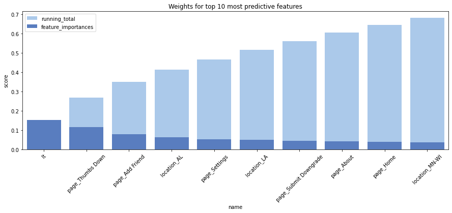
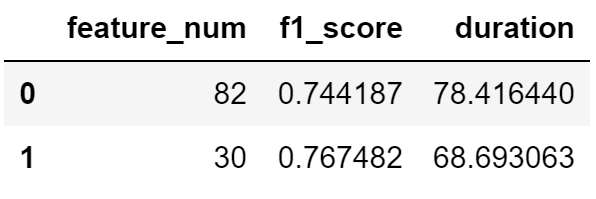

## Project Title
Sparkify--Pyspark-Big-Data-Project

## by Fan Li

## Date created
Project is created on 2020 Jul 15.

## Table of Contents
1. [Description](#description)
2. [Workflow](#Workflow)
	1. [ELT Pipeline](#etl)
	2. [Exploratory Data Analysis](#eda)
	3. [Feature Engineering](#eeg)
	4. [Modeling](#mol)
	5. [Dimension reduction](#drm)

3. [Dataset](#Dataset)
4. [Summary of Project](#summary)
5. [Files](#About)
6. [Software used](#Software)

## Description
Imagine you are working on the data team for a popular digital music service similar to Spotify or Pandora. Many users stream their favorite songs to your service every day, either using the free tier that place advertisements between the songs or using the premium subscription model, where they stream music ad free but pay a monthly flat rate.

It's your job on the data team to predict which users are at risk to churn, either downgrading from premium to free tier or cancelling their service altogether. If you can accurately identify these users before they leave, your business can offer them discounts and incentives, potentially saving your business millions in revenue.

To tackle this project, you will need to load, explore, and clean this dataset with Spark. Based on your explanation, you will create features and build models with Spark to predict which users will churn from your digital music service.

## Workflow:

##### 1. ELT Pipeline
Load large datasets into Spark and manipulate them using Spark SQL and Spark Dataframes. Columns have been modified:

* userAgent
* userId
* location
* Churn

##### 2. Exploratory Data Analysis
Performing some exploratory data analysis to observe the behavior for users who stayed vs users who churned. Examples:

* Churn rate vs gender
* Churn rate by location
* Churn status vs avg songs displayed
* Time series analysis

**...**

##### 3. Feature Engineering
Building out the features we find promising to train the model on.
> categorical features
  * gender
  * location
  * OS

> numerical features
* Num of distinct artist
* Total length
* Num of songs played
* Num of 404 status received
* Customer lifetime
* page count

> vectors assemble and feature normalization
* 1 userId column
* 1 label column
* 83 feature columns

##### 4. Modeling
Split the full dataset into train, test, and validation sets. Test out several of the machine learning methods. Evaluate the accuracy of the various models, tuning parameters as necessary. Determine the winning model based on test accuracy and report results on the validation set.

> Initial model selection
* Random Forest
* GBT
* LinearSVC

>Hyperparameter tune (GBT)
* maxDepth
* maxIter

>Feature importance

##### 5. Dimension reduction
The original dataframe `final_df` has 83 features, we can see from the  `Weights for top 10 most predictive features` plot that 10 features already carry well over 60% of weights. Futhermore, `fp` dataframe shows 30 features carry over 98% of weights.

Reducing dimension to top 30 features will be cheaper in terms of time consume and computing power while model still remains promising output.

## Dataset

* `mini_sparkify_event_data.zip`: usage information details. Size: 10.2MB (due to file size limitation, zip file is uploaded)
* `medium-sparkify-event-data.zip`: usage information details. For works performed on IBM Watson Studio. Size: 19.6MB (due to file size limitation, zip file is uploaded)
* Full 12G data set is not included (For works performed on AWS)

## Summary of Project

1. Since the churned users are a fairly small subset, the data is imbalanced, using F1 score as the metric is the fair call.

A quick summary of our initial models:

* Random Forest F1 score 0.6410174880763115.
* GBT F1 score 0.7456568331672422.
* Linear SVC F1 score 0.625548726953468.

2. Because GBT outperformed the other two models, I choose it as the base model. After tuning parameters the best model reached over 0.74 as f1 score. Parameters specification:
* maxDepth: 5
* maxIter: 10

3. The feature reduced model takes less time to train and predict, it decreased time by 12.4% versus the full feature model. Surprisingly, the feature reduced model also increased f1 score by a small amount of 3.13%. This is a classic example of bias-variance tradeoff. More features yield a better performance on the training set, as it generalizes worse on the test set. In other words the full feature model might suffer from overfitting.

## Files In The Repository
+ [`Jupyter Notebook file`](https://github.com/victorlifan/Sparkify--Pyspark-Big-Data-Project/blob/master/Sparkify.ipynb): workspace where I performed the works.
+ [`data_zip`](https://github.com/victorlifan/Sparkify--Pyspark-Big-Data-Project/tree/master/data_zip): a folder contains dataset zip files
+ [`ima`](https://github.com/victorlifan/Sparkify--Pyspark-Big-Data-Project/tree/master/ima): png files were displayed in READMEs

## Software used
+ Jupyter Notebook
+ Atom
+ Python 3.7
> + Numpy
> + Pandas
> + Matplotlib
> * Seaborn
+ Spark 3.0
>* Pyspark SQL
>* Pyspark ML

## Credits
* [How to Install and Run PySpark in Jupyter Notebook on Windows](https://changhsinlee.com/install-pyspark-windows-jupyter/#comment-4302741820)
* [Feature Selection Using Feature Importance Score - Creating a PySpark Estimator](https://www.timlrx.com/2018/06/19/feature-selection-using-feature-importance-score-creating-a-pyspark-estimator/)
+ Data provided by: [DATA SCIENTIST NANODEGREE PROGRAM](https://www.udacity.com/course/data-scientist-nanodegree--nd025)
+ Instruction and assist: [DATA SCIENTIST NANODEGREE PROGRAM](https://www.udacity.com/course/data-scientist-nanodegree--nd025)
